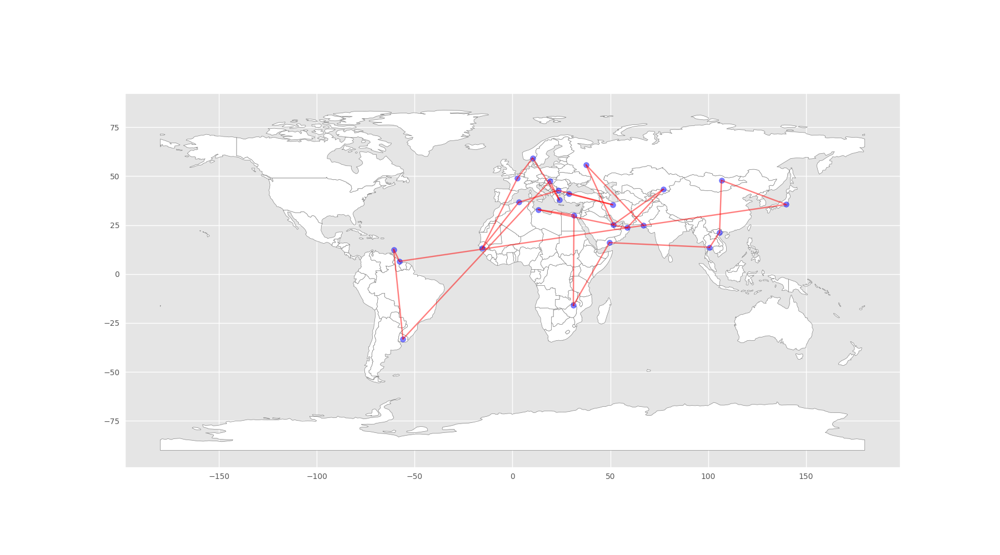
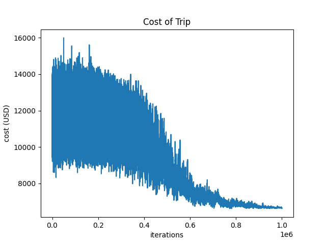

# Annealing-of-Nations
Use Simulated Annealing to solve Taveling Salesperson Problem.  The goal is to find a near-optimum multi-city flight route to complete a tour of the countries listed in the They Might Be Giants song "Alphabet of Nations".

## Introduction

**Motivation:** Fun integration of API skills and algorithm skills. 

nations = [Algeria, Bulgaria, Cambodia, Dominica, Egypt, France, Gambia, Hungary, Iran, Japan, Kazakhstan, Libya Mongolia, Norway, Oman, Pakistan, Qatar, Russia, Suriname, Turkey, Uruguay, Vietnam, West Xylophone*, Yemen, Zimbabwe]

*Use Xylokeriza, Greece.

**Music Video:** https://www.youtube.com/watch?v=drgrvDypOjA

## Results

Here is a map of the optimized flight routes:

Here is the total trip cost per iteration.  As you can see, initial the total cost varied between $9k-$15k, with it settling towards $6k at the end.

## Solution Stack

**Flight Data:** Use solution from "Flight Deal Finder" capstone project (Day 39 - 100 Days of Code Challenge)
- Choose flights from busiest airport in (or near) each country.
- Populate list of airports in Google Sheets and load via Sheety API
    - https://docs.google.com/spreadsheets/d/19raiE-l9t2JQhXz9MIMl93NWHnDpGyqgyGUEPSGaBk0/edit?usp=sharing
- Using the Tiquila API via Kiwi.com, pull flight route pricing.  Flight rules:
    - Cheapest oneway flights with up to 3 layovers
    - Flight date anytime within 6 months of query date

**Optimization:** Use simulated annealing.
- Use simulated annealing as applied to the traveling salesperson problem.
    - https://en.wikipedia.org/wiki/Simulated_annealing
- Will need to validate if paths are valid.

**Visualization:** 
- Visual of flight path on map, total cost of optimum rounte.  May include cost of least optimum route as well.
